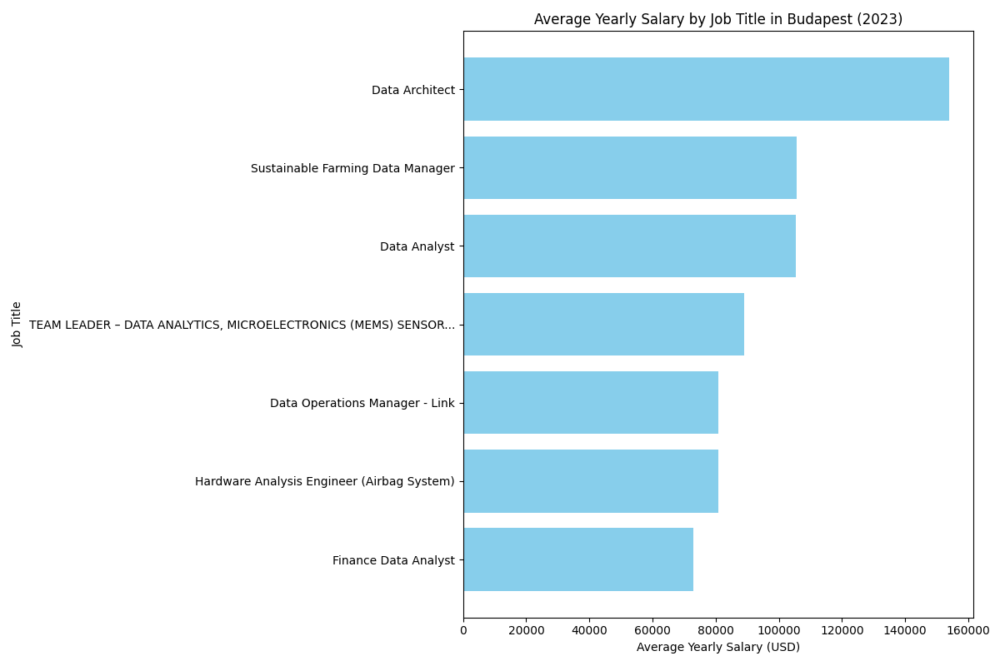
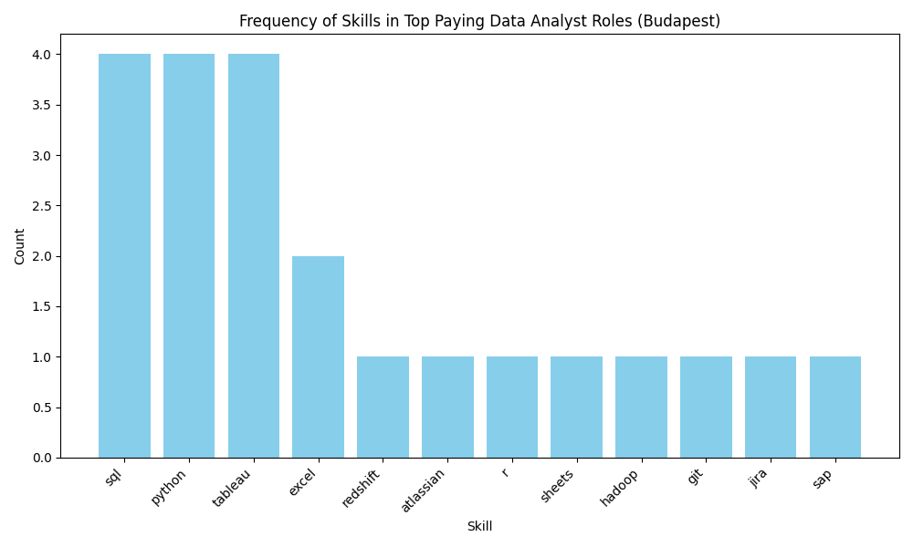

# Introduction

Dive into the data job market! Focusing on data analyst roles, this project explores top-paying jobs, in-demand skills, and where high demand meets high salary in data analytics mostly in Budapest, Hungary.

🔍 SQL queries? Check them out here: [project_sql folder](/project_sql/)

# Background

This project was made based on an online [SQL Course](https://www.lukebarousse.com/sql) by Luke Barousse.

### The questions I wanted to answer in the project were:

1. What are the top-paying data analyst jobs in Budapest?
2. What skills are required for these top-paying jobs in Budapest?
3. What skills are most in demand for data analysts in Budapest?
4. Which skills are associated with higher salaries in Budapest?
5. What are the most optimal skills to learn worldwide?

# Tools I used

For my deep dive into the data analyst job market, I harnessed the power of several key tools:

- **SQL:** The backbone of my analysis, allowing me to query the database and unearth critical insights.
- **PostgreSQL:** The chosen database management system, ideal for handling the job posting data.
- **Visual Studio Code:** My go-to for database management and executing SQL queries.
- **Git & GitHub:** Essential for version control and sharing my SQL scripts and analysis, ensuring collaboration and project tracking.

# The Analysis

Each query for this project aimed at investigating specific aspects of the data analyst job market. Here’s how I approached each question:

### 1. Top Paying Data Analyst Jobs in Budapest

To identify the highest-paying roles, I filtered data analyst positions by average yearly salary and location, focusing on jobs found in Budapest, Hungary. This query highlights the high paying opportunities in the field.

```sql
SELECT
    job_id,
    job_title,
    job_location,
    job_schedule_type,
    salary_year_avg,
    job_posted_date,
    name AS company_name
FROM job_postings_fact
LEFT JOIN company_dim ON job_postings_fact.company_id = company_dim.company_id
WHERE job_title_short = 'Data Analyst'
    AND job_location = 'Budapest, Hungary'
    AND salary_year_avg IS NOT NULL
ORDER BY
    salary_year_avg DESC
LIMIT 10;
```

Here's the breakdown of the top data analyst jobs in 2023:

- **Wide Salary Range:** Top 10 paying data analyst roles in Budapest span from $72,900 to $154,000, indicating significant salary potential in the field.
- **Diverse Employers:** Companies like Richter Gedeon, Prezi, and Bosch are among those offering high salaries, showing a broad interest across different industries.
- **Job Title Variety:** There's a high diversity in job titles, from Data Analyst to Sustainable Farming Data Manager, reflecting varied roles and specializations within data analytics


_Bar graph visualizing the salary for the top 10 salaries for data analysts. The 4 Data Analyst job titles were averaged into 1; Google Gemini generated this graph from my SQL query results_

## 2. Skills for Top Paying Jobs in Budapest

To understand what skills are required for the top-paying jobs in Budapest, I joined the job postings with the skills data, providing insights into what employers value for high-compensation roles.

```sql
WITH top_paying_jobs AS (
    SELECT job_id,
        job_title,
        salary_year_avg,
        name AS company_name
    FROM job_postings_fact
        LEFT JOIN company_dim ON job_postings_fact.company_id = company_dim.company_id
    WHERE job_title_short = 'Data Analyst'
        AND job_location = 'Budapest, Hungary'
        AND salary_year_avg IS NOT NULL
    ORDER BY salary_year_avg DESC
    LIMIT 10
)
SELECT top_paying_jobs.*,
    skills
FROM top_paying_jobs
    INNER JOIN skills_job_dim ON top_paying_jobs.job_id = skills_job_dim.job_id
    INNER JOIN skills_dim ON skills_job_dim.skill_id = skills_dim.skill_id
ORDER BY salary_year_avg DESC;
```

Keep in mind not every company from the top 10 may list their skill requirements in their job postings.
Here's the breakdown of the most demanded skills for the top 10 highest paying data analyst jobs in 2023:

- **SQL** and **Python** and **Tableau** is leading with a bold count of 4.
- **Excel** follows closely with a count of 2.
- Skills like **git**, **jira**, **hadoop** and **r** are bottoming the results with the count of 1.


_Bar graph visualizing the count of skills for the top 10 paying jobs for data analysts in Budapest; Google Gemini generated this graph from my SQL query results_

## 3. In-Demand Skills for Data Analysts in Budapest

This query helped identify the skills most frequently requested in job postings, directing focus to areas with high demand.

```sql
SELECT skills,
    COUNT(skills_job_dim.job_id) AS demand_count
FROM job_postings_fact
    INNER JOIN skills_job_dim ON job_postings_fact.job_id = skills_job_dim.job_id
    INNER JOIN skills_dim ON skills_job_dim.skill_id = skills_dim.skill_id
WHERE job_title_short = 'Data Analyst'
    AND job_location = 'Budapest, Hungary'
GROUP BY skills
ORDER BY demand_count DESC
LIMIT 5;
```

Here's the breakdown of the most demanded skills for data analysts in 2023

- **SQL** and **Excel** remain fundamental, emphasizing the need for strong foundational skills in data processing and spreadsheet manipulation.
- **Programming** and **Visualization Tools** like **Python**, **Tableau**, and **Power BI** are essential, pointing towards the increasing importance of technical skills in data storytelling and decision support.

| Skills   | Demand Count |
| :------- | :----------- |
| sql      | 227          |
| excel    | 225          |
| python   | 150          |
| tableau  | 117          |
| power bi | 113          |

_Table of the demand for the top 5 skills in data analyst job postings in Budapest_

## 4. Skills Based on Salary in Budapest

Exploring the average salaries associated with different skills revealed which skills are the highest paying in Budapest.

```sql
SELECT skills,
    ROUND(AVG(salary_year_avg), 0) AS avg_salary
FROM job_postings_fact
    INNER JOIN skills_job_dim ON job_postings_fact.job_id = skills_job_dim.job_id
    INNER JOIN skills_dim ON skills_job_dim.skill_id = skills_dim.skill_id
WHERE job_title_short = 'Data Analyst'
    AND salary_year_avg IS NOT NULL
    AND job_location = 'Budapest, Hungary'
GROUP BY skills
ORDER BY avg_salary DESC
LIMIT 10;
```

Here's a breakdown of the results for top paying skills for Data Analysts:

Here's a breakdown of the results for top-paying skills for Data Analysts in Budapest:

- **Premium on Data Engineering and Cloud Warehousing:** The highest average salary is commanded by professionals skilled in **Redshift**, signaling that expertise in cloud data warehousing and the ability to manage large-scale data architecture is the most lucrative niche in the local market.
- **Core Programming and Statistical Dominance:** **Python** and **R** remain high-earning staples, reflecting a strong market demand for analysts who can go beyond basic reporting to perform advanced statistical modeling, automation, and predictive analytics.
- **Value of Lifecycle and Workflow Management:** High compensation for skills in **Atlassian** tools, **Jira**, and **Git** suggests that the Budapest market places a premium on analysts who understand the software development lifecycle, version control, and agile project management.
- **Business Intelligence vs. Traditional Tools:** While essential, traditional tools like **Excel** sit at the lower end of the high-pay spectrum compared to specialized visualization platforms like **Tableau**, emphasizing that moving toward modern BI tools significantly increases earning potential.

| Skills    | Average Salary ($) |
| :-------- | :----------------- |
| redshift  | 111202             |
| python    | 102494             |
| atlassian | 100500             |
| tableau   | 99819              |
| r         | 98500              |
| sql       | 94189              |
| jira      | 89100              |
| hadoop    | 89100              |
| git       | 89100              |
| excel     | 86414              |

_Table of the average salary for the top 10 paying skills for data analysts in Budapest_

## 5. Most Optimal Skills to Learn

Combining insights from demand and salary data, this query aimed to pinpoint skills that are both in high demand and have high salaries, offering a strategic focus for skill development. For this query I did not look for just job postings in Budapest, instead my scope was for jobs that you can work from home as well.

```sql
SELECT
    skills_dim.skill_id,
    skills_dim.skills,
    COUNT(skills_job_dim.job_id) AS demand_count,
    ROUND(AVG(job_postings_fact.salary_year_avg), 0) AS avg_salary

FROM job_postings_fact
INNER JOIN skills_job_dim ON job_postings_fact.job_id = skills_job_dim.job_id
INNER JOIN skills_dim ON skills_job_dim.skill_id = skills_dim.skill_id
WHERE
    job_title_short = 'Data Analyst'
    AND salary_year_avg IS NOT NULL
    AND job_work_from_home = true
GROUP BY
    skills_dim.skill_id
HAVING
    COUNT(skills_job_dim.job_id) > 10
ORDER BY
    avg_salary DESC,
    demand_count DESC
LIMIT 25;
```

Here's a breakdown of the most optimal skills for Data Analysts in 2023:

- **High-Demand Programming Languages:** Python and R stand out for their high demand, with demand counts of 236 and 148 respectively. Despite their high demand, their average salaries are around $101,397 for Python and $100,499 for R, indicating that proficiency in these languages is highly valued but also widely available.
- **Cloud Tools and Technologies:** Skills in specialized technologies such as Snowflake, Azure, AWS, and BigQuery show significant demand with relatively high average salaries, pointing towards the growing importance of cloud platforms and big data technologies in data analysis.
- **Business Intelligence and Visualization Tools:** Tableau and Looker, with demand counts of 230 and 49 respectively, and average salaries around $99,288 and $103,795, highlight the critical role of data visualization and business intelligence in deriving actionable insights from data.
- **Database Technologies:** The demand for skills in traditional and NoSQL databases (Oracle, SQL Server, NoSQL) with average salaries ranging from $97,786 to $104,534, reflects the enduring need for data storage, retrieval, and management expertise.

| Skill      | Demand Count | Average Salary ($) |
| :--------- | :----------- | :----------------- |
| Go         | 27           | 115,320            |
| Confluence | 11           | 114,210            |
| Hadoop     | 22           | 113,193            |
| Snowflake  | 37           | 112,948            |
| Azure      | 34           | 111,225            |
| BigQuery   | 13           | 109,654            |
| AWS        | 32           | 108,317            |
| Java       | 17           | 106,906            |
| SSIS       | 12           | 106,683            |
| Jira       | 20           | 104,918            |

_Table of the most optimal skills for data analyst sorted by salary_

# What I Learned

Throughout this project, I've developed my SQL toolkit:

- **Complex Query Crafting:** Mastered the art of advanced SQL, merging tables like a pro and wielding WITH clauses for ninja-level temp table maneuvers.
- **Data Aggregation:** Got cozy with GROUP BY and turned aggregate functions like COUNT() and AVG() into my data-summarizing sidekicks.
- **Analytical Thinking:** Leveled up my real-world puzzle-solving skills, turning questions into actionable, insightful SQL queries.

# Conclusion

### Insights

From the analysis, several general insights emerged:

1. **Top-Paying Data Analyst Jobs:** The highest-paying jobs for data analysts in Budapest offer a wide range of salaries, the highest at $154,000!
2. **Skills for Top-Paying Jobs:** High-paying data analyst jobs require advanced proficiency in SQL, suggesting it’s a critical skill for earning a top salary.
3. **Most In-Demand Skills:** SQL is also the most demanded skill in the data analyst job market, thus making it essential for job seekers.
4. **Skills with Higher Salaries:** Specialized skills, such as Redshift and Atlassian, are associated with the highest average salaries, indicating a premium on niche expertise.
5. **Optimal Skills for Job Market Value:** SQL leads in demand and offers for a high average salary, positioning it as one of the most optimal skills for data analysts to learn to maximize their market value.

### Closing thoughts

This project enhanced my SQL skills and provided valuable insights into the data analyst job market. The findings from the analysis serve as a guide to prioritizing skill development and job search efforts. Aspiring data analysts can better position themselves in a competitive job market by focusing on high-demand, high-salary skills. This exploration highlights the importance of continuous learning and adaptation to emerging trends in the field of data analytics.
